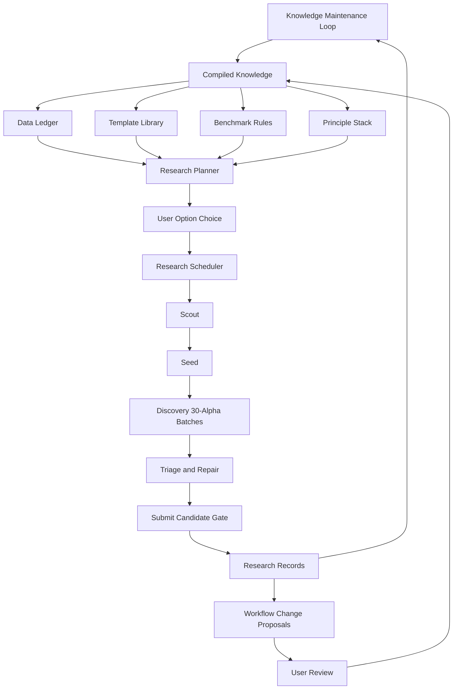

# Long-Term Self-Optimizing Brain Workflow Design

Date: 2026-07-10

## Purpose

This design turns BrainWorkflow into a long-term, maintainable WorldQuant BRAIN research system. The system should keep the existing Stage 1 alpha execution workflow intact while adding durable planning, knowledge, data scheduling, template library, benchmark calibration, and workflow-improvement layers.

The core objective is not simply to run more simulations. The workflow should decide what to research from consultant incentives, current platform activities, available data, prior data usage, template knowledge, and portfolio needs. It should then run the selected research path efficiently and convert results into reusable knowledge.

## Core Boundary

The system has two separate loops:

1. Research workflow run: consumes existing compiled knowledge and runs research.
2. Knowledge maintenance workflow: refreshes raw sources, compiles wiki pages, updates ledgers, and proposes rule changes.

Starting a research workflow must not trigger a large knowledge-base compile. It may perform only lightweight freshness checks and dynamic platform refreshes needed to avoid stale decisions.

## Non-Goals

- Do not replace the existing Scout, Seed, Discovery, Repair, and Submit execution chain.
- Do not automatically submit alphas. Submission remains gated by platform checks and explicit user confirmation.
- Do not automatically modify core workflow rules. The system generates rule-change proposals; the user decides whether to apply them.
- Do not rebuild Learn, forum, operator, and documentation knowledge during every research run.
- Do not treat forum or advisor experience as official rules unless explicitly marked as experience and validated against platform behavior.

## Current Foundation

The current system already includes:

- `wqb/research_planner.py`: principle-led option-card generation.
- `wqb/rule_refresh.py`: official incentive and activity refresh.
- `wqb/data_catalog.py`: dataset, field, and operator metadata fetching and cache helpers.
- `wqb/semantics.py`: early field and operator semantic embeddings.
- `wqb/generator.py`: economic, relational, and semantic candidate generation.
- `wqb/novelty.py`: expression novelty scoring against prior records.
- `wqb/benchmark.py`: hard pass, repairable signal, and discard classification.
- `wqb/research_workflow.py`: stage budgets, prechecks, parallel task definitions, near-miss detection, and issue-to-rule mapping.
- `knowledge/`: shared Obsidian vault with Markdown raw sources and compiled wiki pages.

This design builds on these modules rather than replacing them.

## Architecture

## Loop 1: Research Workflow Run

The research workflow run is optimized for speed and focus. It reads compiled knowledge and current ledgers, performs lightweight dynamic checks, asks the user to choose a research option, then builds a concrete plan for the selected option.

### Inputs

- `knowledge/wiki/00_principles/principle_stack.md`
- `knowledge/wiki/20_semantics/data_fields_and_datasets.md`
- `knowledge/wiki/20_semantics/operators.md`
- `knowledge/wiki/30_templates/template_families.md`
- future `knowledge/wiki/20_semantics/data_ledger.md`
- future `knowledge/wiki/30_templates/template_library.md`
- `knowledge/wiki/50_benchmarks/`
- `knowledge/wiki/70_decisions/`
- latest platform dynamic refresh for account state, activities, competitions, Power Pool boards, Theme state, and in-flight simulation/check status.

### Research-Run Steps

1. Run a lightweight freshness check on Data Ledger, Template Library, Benchmark Rules, and Activity Snapshot timestamps.
2. Refresh only dynamic platform state needed for current decisions.
3. Generate 3-5 research option cards from consultant incentives, platform opportunities, ledger gaps, template availability, benchmark rules, and portfolio needs.
4. Ask the user to choose one option.
5. Convert the selected option into a concrete research schedule with activity, region, delay, dataset families, template families, batch count, simulation budget, local gates, and stop rules.
6. Execute the existing Stage 1 chain: Scout, Seed, Discovery, Triage, Repair, and Submit Candidate Gate.
7. Record raw research results and generate workflow-change proposals when repeated issues or strong lessons appear.

### Runtime Staleness Behavior

If compiled knowledge is stale, the research workflow should not silently rebuild it. It should present one of three choices:

- continue with stale warning;
- refresh only dynamic platform state;
- stop and launch the knowledge maintenance workflow.

## Loop 2: Knowledge Maintenance Workflow

The knowledge maintenance workflow is a separate manual or scheduled task. It can be started after a research day, weekly, or through Codex automation.

### Maintenance Steps

1. Capture official platform Learn, operators, documentation, activities, competitions, Power Pool boards, Theme rules, account-rule pages, and relevant forum/advisor material into Markdown raw files.
2. Keep exact machine JSON outside the Obsidian vault in ignored cache directories for deterministic diffing.
3. Diff raw Markdown manifests and exact cache hashes against the prior capture.
4. Generate an affected-wiki report.
5. Recompile only affected wiki pages.
6. Update Data Ledger, Template Library, operator/data semantics, benchmarks, and principles.
7. Run health checks for stale pages, missing backlinks, broken source pointers, orphan raw files, outdated thresholds, and repeated unresolved workflow issues.
8. Generate rule-change proposals for user review.

## Data Ledger

The Data Ledger is the scheduling memory for platform data. It must let the planner answer:

- What data is available?
- What data has been used in simulations?
- What data has been used in submitted alphas?
- Which data families are underexplored?
- Which data families are crowded or correlation-prone?
- Which data families match current incentives and activities?

### Data Ledger Records

Each dataset or field family should record:

- dataset id and dataset name;
- region, delay, universe, and instrument availability;
- field ids, field types, and vector or event requirements;
- coverage, date coverage, alpha count, user count, and category;
- semantic tags such as fundamental, analyst revision, event, options, sentiment, short interest, attention, liquidity, quality, growth, risk, or uncertainty;
- crowding risk and correlation risk;
- known usable operators and template families;
- simulation usage count;
- repair usage count;
- submitted-alpha usage count;
- last used timestamp;
- best observed result label: hard pass, repairable signal, prod-correlation fail, self-correlation fail, turnover fail, weak discard;
- source links back to raw platform captures and experiment records.

### Data Scheduling Rules

The planner should prefer data that:

- serves the selected consultant incentive;
- has clear economic meaning;
- is available in the selected region-delay-universe scope;
- has lower crowding or a distinct update cadence;
- is underused by the user's submitted and simulated alpha history;
- has a matching template family with low correlation risk;
- fills a portfolio gap for Genius, Osmosis, Power Pool, Theme, competition, or dormancy safety.

The planner should down-rank data that:

- already dominates submitted or recent simulated alphas;
- repeatedly produced weak discard outcomes;
- has high production-correlation risk from common fields and old templates;
- requires unsupported operators or field types for the targeted activity;
- has stale or missing metadata.

## Template Library

The Template Library is the strategy-memory layer. It converts economic ideas and operator semantics into reusable templates.

### Template Records

Each template should record:

- template id;
- one-sentence economic hypothesis;
- expression skeleton;
- intended direction and interpretation;
- required field type: matrix, vector, event, Fast D1, paired field, or grouped field;
- compatible data semantic tags;
- operator semantic tags;
- suitable region, delay, horizon, neutralization, decay, and turnover bucket;
- expected correlation risk;
- known anti-patterns and crowded variants;
- local gates before simulation;
- repair levers;
- experiment links;
- current status: scout_only, seed, discovery_ready, repair_only, deprecated, or submit_proven.

### Operator And Data Embeddings

Operator embeddings should stay human-readable. They should tag what an operator does, such as:

- cross-sectional normalization;
- time-series smoothing;
- time-series surprise;
- event gating;
- vector reduction;
- group neutralization;
- tail control;
- turnover control;
- missing-data repair.

Data embeddings should tag economic meaning and usage shape, such as:

- value;
- growth;
- quality;
- profitability;
- leverage;
- liquidity;
- attention;
- sentiment;
- analyst revision;
- option-implied risk;
- short interest;
- event freshness;
- uncertainty;
- crowding risk.

The planner uses the intersection of data embeddings and template requirements to generate Scout and Seed candidates.

### Template Innovation

Template innovation is periodic and proposal-driven. It should generate low-correlation ideas by combining:

- new or underused data;
- a distinct economic hypothesis;
- less common operator skeletons;
- event or vector transformations when economically justified;
- alternative neutralization only when it changes risk exposure for a reason;
- longer or shorter horizons only when they match the data update cadence.

Template innovation must produce proposals, not automatically replace the active template library.

## Scout And Seed Knowledge Usage

Scout and Seed must use the knowledge base before generating candidates.

### Scout

Scout explores new or underused data with simple, economically interpretable templates.

Scout should:

- query the Data Ledger for suitable data candidates;
- query the Template Library for compatible simple templates;
- build 30 candidates before simulation when feasible;
- apply local gates for syntax, field availability, expression complexity, novelty, prior self-correlation proxy, and known prod-correlation risk;
- record dataset-template signal findings rather than only individual alpha ids.

### Seed

Seed converts a signal-bearing data-template pair into a reusable research object.

Seed records:

- data family and fields;
- template id and rendered expression family;
- economic rationale;
- settings;
- signal evidence;
- failed checks;
- repair levers;
- correlation risk;
- next action: Discovery, Repair, discard, or monitor.

## Workflow Optimizer

The Workflow Optimizer turns repeated problems and new lessons into proposals.

It does not directly change production rules. It writes change proposals that the user reviews.

### Proposal Triggers

Generate a proposal when:

- the same check failure repeats across a data-template family;
- a PnL signal is misclassified by current benchmarks;
- self-correlation or prod-correlation failures cluster around a template or data family;
- a repair lever repeatedly succeeds or fails;
- a dataset consistently underperforms despite apparent economic logic;
- a new activity or incentive changes planning priorities;
- a source-refresh diff changes official rules, thresholds, or available data.

### Proposal Format

Each proposal should include:

- title;
- trigger;
- evidence sources;
- affected workflow modules;
- proposed rule change;
- expected benefit;
- risk of overfitting or unintended behavior;
- required code changes, if any;
- required knowledge-page updates;
- user decision options: accept, reject, revise, defer.

### Proposal Storage

Rule-change proposals should be written to:

- `knowledge/wiki/70_decisions/workflow_change_proposals.md`
- future machine-readable companion: `knowledge/wiki/70_decisions/workflow_change_proposals.jsonl`

Accepted proposals can then update:

- `knowledge/wiki/50_benchmarks/`
- `knowledge/wiki/60_workflows/`
- `knowledge/wiki/30_templates/`
- `knowledge/wiki/20_semantics/`
- code and tests in `skills-and-workflows/BrainWorkflow/`.

## Command Shape

The long-term system should expose two command families.

### Research Commands

These consume compiled knowledge and execute research:

- `plan-research-options`
- future `schedule-research`
- `run-stage1`
- `run-expression-file`
- `field-batch`
- `complete-in-flight`
- `refresh-alpha`
- `repair-alpha-with-field`

Research commands should not run heavy raw capture or full wiki compile.

### Maintenance Commands

These refresh and compile knowledge:

- future `refresh-knowledge`
- future `compile-knowledge`
- future `update-data-ledger`
- future `update-template-library`
- future `propose-workflow-rules`
- future `knowledge-health-check`

Maintenance commands may be run manually after a research day, weekly, or through Codex automation.

## Parallel Work Boundaries

The workflow should support subagent-style parallelism through explicit task boundaries.

Safe parallel lanes:

- platform/source refresh;
- data ledger update;
- template library update;
- benchmark review;
- experiment log compilation;
- Scout runs across independent dataset families;
- diagnosis of completed run directories;
- rule-change proposal drafting.

Unsafe parallel lanes:

- submitting the same alpha;
- modifying the same rule file without coordination;
- running repair on a weak branch before diagnosis;
- starting replacement simulations before in-flight recovery finishes;
- promoting candidates without latest check results.

## Quality Gates

### Research Option Gate

Before execution, every option card must include:

- primary incentive;
- why now;
- candidate scope;
- data and template rationale;
- expected asset value;
- correlation risk;
- resource cost;
- evidence;
- likely failure modes;
- user decision requested.

### Batch Gate

Before simulation, every 30-alpha batch should pass:

- expression syntax sanity;
- field availability check;
- field type compatibility check;
- template complexity check;
- novelty score check;
- self-correlation proxy check;
- production-correlation risk down-rank;
- activity-specific constraints such as Power Pool field/operator limits.

### Submit Candidate Gate

Only alphas with all required platform checks passed can enter the submit-candidate list. Failed or pending mandatory checks block promotion.

## Knowledge Freshness Policy

Suggested freshness targets:

- dynamic activity/account snapshot: before each research session;
- Data Ledger: daily during active research or after large metadata refresh;
- Template Library: after each research day and weekly review;
- Benchmark Rules: after each meaningful run and formal review every three active research days;
- Learn/operators/docs/forum source compile: weekly or when a platform rule changes;
- cleanup policy review: monthly.

The research workflow may warn about stale knowledge, but it does not auto-compile unless the user starts a maintenance command.

## Implementation Slices

### Slice 1: Knowledge Contracts

Define data structures and Markdown formats for:

- Data Ledger;
- Template Library;
- workflow-change proposals;
- knowledge freshness manifests.

### Slice 2: Read-Only Consumers

Add loaders that let the planner consume:

- Data Ledger;
- Template Library;
- benchmark rules;
- recent experiment summaries.

### Slice 3: Incentive-Aware Scheduler

Create a scheduler that turns a user-selected option into:

- activity;
- region-delay-universe scope;
- dataset candidates;
- template candidates;
- batch design;
- API budget;
- stopping criteria;
- parallel task plan.

### Slice 4: Maintenance Loop

Add commands for:

- refresh knowledge;
- compile knowledge;
- update data ledger;
- update template library;
- generate rule-change proposals;
- run knowledge health checks.

### Slice 5: Proposal Review And Application

Add a review workflow where accepted proposals update wiki pages, benchmark rules, template rules, or code tests.

## Success Criteria

The design is successful when:

- research workflow startup consumes existing knowledge instead of recompiling it;
- Data Ledger guides data scheduling and avoids repeated data overuse;
- Template Library guides Scout and Seed generation;
- planner choices reflect consultant incentives and current activities;
- repeated failures produce rule-change proposals;
- accepted rule changes become tests, benchmark updates, template updates, or planner scoring updates;
- submit candidates include only alphas passing all required platform checks;
- knowledge maintenance can be run manually or through automation without blocking normal research sessions.
