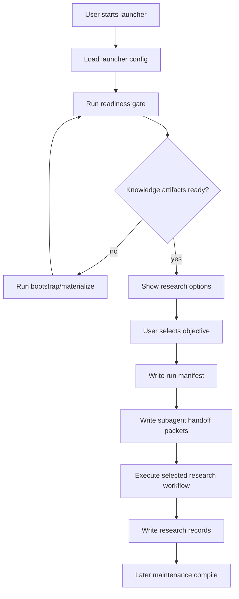

# Workflow Launcher, Knowledge Bootstrap, And Run Readiness Design

## Purpose

This design extends the long-term BrainWorkflow system with a reliable startup path.
The immediate problem is that the research commands exist, but the root Obsidian
knowledge vault does not yet contain the formal compiled artifacts that the
planner is supposed to consume:

- `knowledge/wiki/20_semantics/data_ledger.jsonl`
- `knowledge/wiki/20_semantics/data_ledger.md`
- `knowledge/wiki/30_templates/template_library.jsonl`
- `knowledge/wiki/30_templates/template_library.md`
- `knowledge/wiki/80_maintenance/freshness_manifest.json`

The startup path must make this state explicit. It should prevent research runs
from starting with missing scheduling memory, while giving the user a simple way
to configure a run and delegate bounded work to subagents.

## Relationship To Existing Specs

This spec implements the entry layer around the existing long-term workflow
foundation. It does not replace the existing Stage 1 execution workflow.

It sits after:

- `2026-07-10-long-term-self-optimizing-brain-workflow-design.md`
- `2026-07-10-long-term-workflow-foundation-implementation.md`

It consumes the existing modules:

- `wqb.data_ledger`
- `wqb.template_library`
- `wqb.knowledge_freshness`
- `wqb.research_scheduler`
- `wqb.workflow_proposals`
- `wqb.cli`

## Goals

1. Provide a launcher that turns user choices into a concrete research-run
   configuration.
2. Materialize the missing formal knowledge artifacts into the root Obsidian
   vault before a research run depends on them.
3. Add a readiness gate that blocks or warns before a run when required inputs
   are missing, stale, unparsable, or too incomplete for the selected mode.
4. Define subagent handoff boundaries so the main task keeps decision context
   while child tasks execute bounded, file-based work.
5. Preserve the current separation between research runs and maintenance runs.

## Non-Goals

- Do not build a full graphical web application in this slice.
- Do not submit alphas automatically.
- Do not automatically change accepted workflow rules.
- Do not crawl every platform document on every research run.
- Do not fabricate platform data coverage as fact when raw sources are missing.
- Do not require subagents to share the main conversation context.

## Architecture



The launcher is a thin orchestrator. It calls existing planner and workflow
functions instead of duplicating alpha generation or simulation logic.

## Component 1: Workflow Launcher

### Responsibility

The launcher owns user-facing startup. It answers:

- What research objective is being started?
- Which region, universe, delay, activity, and data scope are allowed?
- Is the run allowed to call live platform APIs?
- Is the run allowed to simulate?
- Is the run allowed to submit after user confirmation?
- Which execution lanes can be delegated to subagents?

### Interface

Initial implementation should be a CLI/TUI wizard, not a web UI. A web UI can be
added later after the command contract is stable.

Suggested command:

```powershell
python -m wqb.cli launch-workflow --knowledge-root C:\Users\oytl\Desktop\pyproject\brain\knowledge
```

The launcher writes a run manifest:

```text
runs/<timestamp>-<objective>/run_manifest.json
```

The run manifest contains:

- run id;
- created timestamp;
- selected objective;
- selected region, universe, delay, and instrument type;
- selected activity or incentive target;
- allowed data scopes;
- max simulation budget;
- batch size, defaulting to 30;
- execution mode: dry-run, plan-only, simulate, repair, submit-candidate;
- submit policy: never, ask, or blocked;
- knowledge artifact paths used by the run;
- readiness report path;
- subagent handoff packet paths.

### User Experience

The wizard should ask only questions that change execution:

1. Select run type: maintenance bootstrap, planning only, research run, repair
   run, or submit-candidate review.
2. Select objective source: current incentive rules, platform activity,
   emergency submit, or manual idea.
3. Select market scope: region, universe, delay, neutralization preference.
4. Select safety mode: plan-only, live API without submit, or live API with
   submit confirmation.
5. Confirm readiness result and generated run manifest.

Defaults should be conservative:

- plan-only when readiness is not clean;
- no submission without explicit user confirmation;
- batch size 30 for research generation;
- no full knowledge compile during research startup.

## Component 2: Knowledge Bootstrap And Materialize

### Responsibility

The bootstrap command creates the formal knowledge artifacts that research
commands consume. It is a maintenance action, not an implicit side effect of
every research run.

Suggested command:

```powershell
python -m wqb.cli bootstrap-knowledge --knowledge-root C:\Users\oytl\Desktop\pyproject\brain\knowledge
```

### Inputs

Bootstrap may read:

- `knowledge/raw/source_index.md`;
- `knowledge/raw/platform/learn/**.md`;
- `knowledge/raw/research/**.md`;
- `knowledge/wiki/20_semantics/*.md`;
- `knowledge/wiki/30_templates/*.md`;
- `knowledge/wiki/40_experiments/*.md`;
- `skills-and-workflows/BrainWorkflow/docs/knowledge/*.example.jsonl`;
- `skills-and-workflows/BrainWorkflow/docs/knowledge/*.example.json`.

### Outputs

Bootstrap writes:

- `knowledge/wiki/20_semantics/data_ledger.jsonl`
- `knowledge/wiki/20_semantics/data_ledger.md`
- `knowledge/wiki/30_templates/template_library.jsonl`
- `knowledge/wiki/30_templates/template_library.md`
- `knowledge/wiki/80_maintenance/freshness_manifest.json`
- `knowledge/wiki/80_maintenance/bootstrap_report.md`

### Data Ledger Rules

Bootstrap should prefer evidence over completeness:

- Records from raw platform metadata get `source_quality: official_raw`.
- Records from prior research logs get `source_quality: research_observed`.
- Records from example files get `source_quality: schema_seed`.
- Records with incomplete coverage get `coverage_status: partial`.

The readiness gate can allow a partial ledger for planning or repair, but should
warn before broad discovery. Full discovery needs enough data coverage to make
data scheduling meaningful.

Bootstrap must not invent a complete list of platform data fields when the raw
source does not contain it. If platform API metadata is unavailable, the report
must say that the ledger is operational but incomplete.

### Template Library Rules

Template bootstrap can be more assertive than data bootstrap because templates
are research memory, not platform fact. It should compile:

- existing template family notes;
- stage1 repair and scout lessons;
- operator/data semantics pages;
- schema seed templates from example files.

Each template record should include:

- economic hypothesis;
- compatible semantic tags;
- required field types;
- skeleton expression;
- known anti-patterns;
- repair levers;
- correlation risk;
- status.

### Freshness Manifest Rules

The generated manifest must include at least:

- data ledger;
- template library;
- benchmark rules;
- activity snapshot;
- operator catalog;
- research option cards.

Missing optional artifacts may warn. Missing required artifacts should block
strict research readiness.

## Component 3: Run Readiness Gate

### Responsibility

The readiness gate prevents accidental low-quality runs. It runs before
planner, schedule, simulation, repair, and submit-candidate stages.

Suggested command:

```powershell
python -m wqb.cli readiness-check --knowledge-root C:\Users\oytl\Desktop\pyproject\brain\knowledge --mode research
```

### Checks

Readiness checks include:

- required artifact existence;
- JSON and JSONL parse validity;
- freshness manifest strictness;
- stale knowledge status;
- data ledger minimum row count;
- template library minimum row count;
- selected region and delay compatibility;
- batch size is at least 30 for discovery runs;
- live API mode is explicitly enabled before platform calls;
- submit mode requires explicit user confirmation;
- run directory is writable;
- current command does not trigger heavy compile unless mode is maintenance.

### Modes

The gate supports four modes:

- `maintenance`: allows missing compiled artifacts if the goal is to create
  them.
- `plan-only`: warns on partial knowledge but allows option generation.
- `research`: blocks missing required artifacts and stale critical artifacts.
- `submit-candidate`: blocks unless checks, candidate list, and user
  confirmation are present.

### Output

The gate writes:

```text
runs/<timestamp>-<objective>/readiness_report.md
runs/<timestamp>-<objective>/readiness_report.json
```

The Markdown report is for review. The JSON report is for automation.

## Component 4: Subagent Handoff Packets

### Responsibility

Subagents should receive small, bounded tasks with explicit input and output
files. The main task keeps the high-level decision context and reads only the
subagent outputs.

### Handoff Packet Format

Each handoff packet is a Markdown file with optional JSON companion:

```text
runs/<run_id>/handoffs/<lane>.md
runs/<run_id>/handoffs/<lane>.json
```

Each packet includes:

- objective;
- allowed files;
- forbidden actions;
- input artifacts;
- expected output artifact;
- stop condition;
- verification command;
- summary schema.

### Recommended Lanes

The first implementation should define packet generation for these lanes:

- `knowledge-readiness`: inspect knowledge artifacts and write readiness notes.
- `data-scheduling`: rank data candidates from Data Ledger.
- `template-selection`: rank templates from Template Library.
- `batch-construction`: produce 30-alpha candidate files.
- `simulation-monitor`: poll and summarize in-flight simulations.
- `triage`: classify results into abandon, repair, or submit-candidate.
- `workflow-proposal`: convert repeated failures into rule-change proposals.

### Context Protection Rule

Subagents should not receive the whole conversation transcript. They receive the
run manifest, selected knowledge artifacts, and their lane packet. This keeps
the parent context small and makes each output auditable.

## Component 5: Configuration Model

The launcher should read layered configuration:

1. project defaults from repo config;
2. user defaults from a local ignored file;
3. command-line overrides;
4. wizard answers for the current run.

Sensitive values must remain outside tracked files. API credentials are never
written into run manifests.

Suggested tracked config:

```text
BrainWorkflow/config/workflow_defaults.example.json
```

Suggested ignored user config:

```text
BrainWorkflow/config/workflow.local.json
```

The local config can store non-secret preferences such as default region,
universe, delay, batch size, and knowledge root.

## Error Handling

Errors must be explicit and actionable:

- Missing artifact: report the exact expected path and suggest
  `bootstrap-knowledge`.
- Stale artifact: report age, max age, and maintenance command.
- Parse error: report file path and JSON line number when possible.
- Partial ledger: allow plan-only, warn for research, block broad discovery in
  strict mode.
- Live API disabled: stop before making platform calls.
- Submit requested without confirmation: stop before submit.

No command should silently downgrade from strict mode to advisory mode.

## Testing Strategy

Tests should be added before implementation:

1. Bootstrap creates all required files in a temporary knowledge root.
2. Bootstrap preserves source quality instead of treating example rows as
   official platform data.
3. Readiness blocks research mode when ledger or template library is missing.
4. Readiness allows maintenance mode when compiled artifacts are missing.
5. Readiness writes both Markdown and JSON reports.
6. Launcher writes a run manifest with conservative defaults.
7. Launcher refuses live API or submit mode unless explicitly enabled.
8. Handoff packet generation writes one packet per selected lane.
9. Subagent packets contain allowed files, forbidden actions, expected output,
   and verification command.
10. Existing Stage 1 execution tests continue to pass.

## Implementation Slices

### Slice 1: Readiness Gate

Add a pure validation module and CLI command. This slice has no live platform
side effects and should be implemented first.

### Slice 2: Knowledge Bootstrap

Add materialization from existing raw/wiki/example sources into formal ledger,
template library, and freshness manifest files.

### Slice 3: Launcher Manifest

Add the CLI wizard and non-interactive launch mode that writes a run manifest.

### Slice 4: Subagent Handoff Packets

Generate lane packets from the run manifest and selected execution mode.

### Slice 5: Launcher To Existing Commands

Wire launcher output into existing `plan-research-options`,
`knowledge-health-check`, `schedule-research`, and Stage 1 commands. This slice
must still respect readiness gates and submit confirmation.

## Success Criteria

This design is successful when:

- a fresh workspace can run one bootstrap command and get formal knowledge
  artifacts in the root Obsidian vault;
- research runs fail fast when required knowledge is missing;
- users can start a run from one launcher command instead of remembering many
  low-level commands;
- every launched run has a manifest, readiness report, and optional subagent
  handoff packets;
- broad discovery does not run without at least 30 generated candidates;
- submit-candidate mode is blocked unless platform checks have passed and the
  user explicitly confirms submission;
- subagents can execute bounded lanes without consuming the whole parent
  conversation context.
