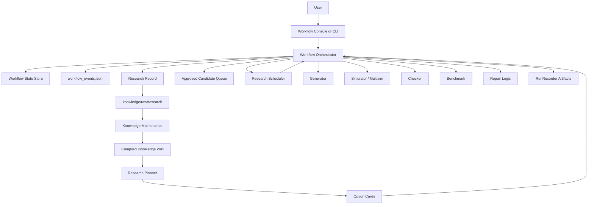
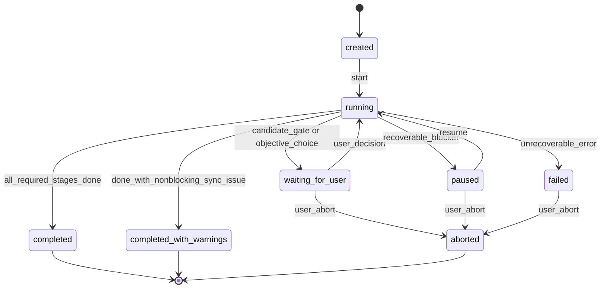
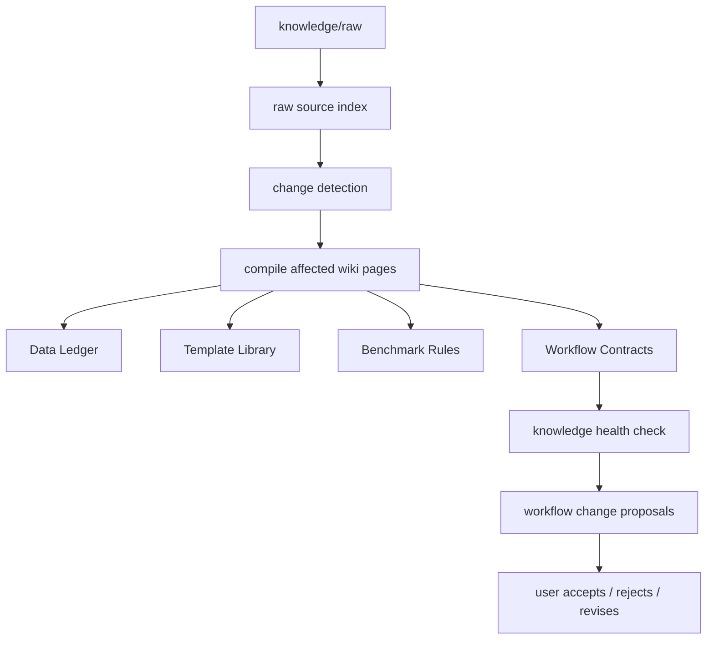

# BrainWorkflow Orchestrator And Workflow State Design

Date: 2026-07-12

## Purpose

This design fixes the long-term operating shape of BrainWorkflow. It keeps the existing research method intact, but changes how the method is directed and resumed.

The research method remains:

```text
Knowledge Maintenance
-> Research Planner / Option Cards
-> User Selects Objective
-> Schedule Research
-> Scout / Seed
-> 30 Alpha Batch
-> Multisim / Backtest
-> Triage
-> Repair Near-Miss
-> Candidate Gate
-> User Approval
-> Approved Candidate Queue
-> Research Record flows back into Knowledge Maintenance
```

The implementation ownership changes:

- Today, a user or Codex can run many CLI commands, and the current state is inferred from scattered logs, Markdown files, and conversation memory.
- After this design, a thin Orchestrator becomes the only component allowed to advance the official workflow state.

The main rule is simple: Codex chat context is never a source of truth. A new Codex session must be able to read files and know exactly what run is active, what stage is current, what has already been done, what waits for user input, and what command or function can run next.

## Beginner Mental Model

BrainWorkflow has three different kinds of work. They must not be mixed.

### 1. Knowledge Maintenance

Knowledge Maintenance is the library and memory system.

It collects platform documentation, Learn pages, operators, activities, forum lessons, strategy notes, research records, and workflow decisions. It compiles those raw materials into a wiki that the planner can use.

It answers:

```text
What does the platform mean?
What data exists?
What operators exist?
Which data and templates have worked before?
Which platform activities and incentive rules matter now?
What workflow lessons have we learned?
```

### 2. Research Run

A Research Run is one concrete attempt to find useful alphas for a chosen objective.

It consumes the compiled knowledge base. It should not rebuild the whole knowledge base as a hidden side effect.

It answers:

```text
What are we researching this time?
Which data and templates did we choose?
Which alphas did we simulate?
Which results were weak, repairable, or candidate-ready?
What did we learn?
```

### 3. Workflow Orchestration

Workflow Orchestration is the traffic controller.

It does not invent alpha ideas. It does not replace the simulator, checker, benchmark, repair logic, or planner. It reads the official state, decides the next legal step, calls existing modules, records evidence, and updates state.

It answers:

```text
Which formal run is active?
Which stage is running or paused?
What can safely happen next?
What must not be repeated?
Why did the workflow stop?
How can it resume after shutdown or Codex usage limits?
```

## Non-Goals

- Do not change the research framework.
- Do not rewrite the existing generator, simulator, checker, benchmark, repair, planner, data ledger, template library, or API client.
- Do not make Codex conversation memory part of workflow state.
- Do not automatically submit alphas.
- Do not run full knowledge recapture during normal research startup.
- Do not hide live API use behind plan-only commands.
- Do not make the UI the source of truth. The UI must read and control the Orchestrator.

## Current Implementation To Preserve

The current project already has useful modules:

- `wqb/research_planner.py`: creates research option cards from incentive and activity context.
- `wqb/research_scheduler.py`: turns selected options into a research schedule.
- `wqb/data_ledger.py`: stores data usage, semantic tags, and scheduling signals.
- `wqb/template_library.py`: stores strategy template knowledge.
- `wqb/generator.py`: generates candidate alpha expressions.
- `wqb/simulator.py`: submits simulations and polls progress.
- `wqb/checker.py`: classifies platform check responses.
- `wqb/benchmark.py`: classifies hard-pass, repairable, and discard outcomes.
- `wqb/research_workflow.py`: stores stage budgets, prechecks, parallel task definitions, and near-miss detection.
- `wqb/recorder.py`: writes local JSONL, CSV, and Markdown run artifacts.
- `wqb/run_readiness.py`: blocks unsafe research and submit-candidate commands.
- `wqb/workflow_launcher.py`: writes launch manifests, readiness reports, and handoff packets.
- `wqb/workflow_proposals.py`: records proposed workflow-rule changes for user review.
- `wqb/console_state.py`: reads current dashboard state for the future console.

These modules become Orchestrator tools. They should stay independently testable.

## Target Architecture



The Orchestrator is thin. It owns state transitions and calls existing tools. The research logic remains in the existing modules.

## Authoritative Files

Each formal Research Run gets one run directory:

```text
runs/<workflow_run_id>/
  run_manifest.json
  run_state.json
  workflow_events.jsonl
  readiness_report.json
  readiness_report.md
  stages/
  research_record.json
  research_record.md
  approval.jsonl
  approved_candidates.jsonl
  artifacts/
```

There is also one fast pointer:

```text
runs/active_run.json
```

`active_run.json` is only an index. If it is missing or stale, the Orchestrator must be able to scan run directories and reconstruct the active run from `run_state.json` and `workflow_events.jsonl`.

## File Responsibilities

### `run_manifest.json`

The manifest is the original plan. It records the objective, selected option, region, universe, delay, budget, knowledge root, and created timestamp.

It answers:

```text
What was this run supposed to do?
```

It should not be used as the changing runtime state.

### `run_state.json`

The state file is the current official state.

It answers:

```text
Where is this run now?
What stage is current?
What was the last completed stage?
Why is the run paused?
What waits for user input?
How much budget is used?
Has the Research Record synced?
What is the next legal action?
```

Only the Orchestrator may write it.

### `workflow_events.jsonl`

The event log is append-only evidence of state changes.

It records events such as:

```text
workflow_created
stage_started
stage_completed
workflow_paused
workflow_resumed
user_approval_requested
candidates_approved
candidate_queued
workflow_aborted
workflow_completed
```

If `run_state.json` is damaged, the event log should help diagnose or rebuild state.

### `research_record.json`

The machine-readable Research Record stores what happened and what was learned.

It covers:

```text
Backtest
Triage
Repair
Candidate Gate
User Approval
Approved Candidate Queue
Manual submission status
```

It stores obvious failures as compact summaries, and stores near-miss, repair, and candidate branches with full version history.

### `research_record.md`

The Markdown Research Record is written for the knowledge base.

It should also be copied or synced to:

```text
knowledge/raw/research/runs/<workflow_run_id>/research_record.md
```

This raw research material later feeds Knowledge Maintenance.

### `approval.jsonl`

Approval records are append-only.

Each approval binds:

```text
candidate_id
platform_alpha_id
version
expression_hash
approved_at
approved_by
source_run_id
```

If expression, version, or hash changes, the old approval is no longer valid for the changed candidate.

### `approved_candidates.jsonl`

This is the queue of candidates the user approved for later manual or API-assisted submission.

Each queued row stores current queue status:

```text
queued
manually_submitted
api_submitted
skipped
invalidated
```

The queue must prevent duplicates by `candidate_id + version + expression_hash`.

## Workflow State Model

### Run Status

The official run status can be:

```text
created
running
waiting_for_user
paused
completed
completed_with_warnings
failed
aborted
```

### Stage Names

The official stage names are:

```text
objective_selected
schedule
scout_seed
batch_generation
backtest
triage
repair
candidate_gate
user_approval
approved_queue
research_record_sync
complete
```

### Stage Status

Each stage can be:

```text
not_started
running
completed
paused
failed
skipped
```

## Legal State Flow



The Orchestrator must reject illegal transitions. For example, it must not run Repair before a near-miss exists, and it must not queue a candidate before approval.

## Research Workflow Under Orchestrator

### 1. Objective Selection

Input:

- compiled knowledge;
- current option cards;
- user-selected objective.

Orchestrator action:

- create formal run;
- write `run_manifest.json`;
- write initial `run_state.json`;
- append `workflow_created`;
- set `active_run.json`.

### 2. Schedule Research

Input:

- selected option;
- Data Ledger;
- Template Library;
- incentive snapshot;
- readiness report.

Existing tools:

- `research_scheduler.py`;
- `run_readiness.py`.

Orchestrator action:

- call scheduler;
- store schedule artifact under the run;
- update stage status;
- append stage events.

### 3. Scout / Seed

Purpose:

Use simple, economically meaningful templates on new or underused data to find signal while reducing self and production correlation risk.

Existing tools:

- `research_workflow.py`;
- `data_ledger.py`;
- `template_library.py`;
- `generator.py`;
- `recorder.py`.

Orchestrator action:

- select data-template pairs from schedule;
- generate 30 candidates per batch where appropriate;
- enforce prechecks;
- write planned candidates;
- call batch execution tools.

### 4. Multisim / Backtest

Purpose:

Run simulations efficiently and record platform outcomes.

Existing tools:

- `simulator.py`;
- `checker.py`;
- `RunRecorder`;
- multisim path in `cli.py`.

Orchestrator action:

- submit simulation or multisim through existing functions;
- track submitted expression hashes;
- record progress URLs;
- avoid duplicate submissions on Resume;
- classify in-flight work before new submissions.

### 5. Triage

Purpose:

Classify results into hard-pass candidate, repairable near-miss, or discard.

Existing tools:

- `checker.py`;
- `benchmark.py`;
- `research_workflow.is_near_miss`.

Orchestrator action:

- read all alpha results;
- write triage decisions into `research_record.json`;
- promote near-miss branches to Repair only when benchmark rules allow it.

### 6. Repair

Purpose:

Spend small targeted budgets on alphas that already show signal.

Existing tools:

- repair helpers in `cli.py`;
- `optimizer.py`;
- `generator.py`;
- `benchmark.py`.

Orchestrator action:

- create 4-8 repair variants per selected near-miss;
- record the repair hypothesis;
- compare each version;
- stop repair when pass, budget exhaustion, or clear rejection occurs.

### 7. Candidate Gate

Purpose:

Stop automatic research before user approval.

Orchestrator action:

- require platform hard checks to pass;
- prepare candidate records;
- set run status to `waiting_for_user`;
- append `user_approval_requested`.

Only hard-check passing alphas can enter candidate approval.

### 8. User Approval

Purpose:

Bind user approval to exact candidate versions.

Orchestrator action:

- accept one or many approved candidates;
- write `approval.jsonl`;
- invalidate approval if expression hash or version changes;
- queue approved candidates.

### 9. Approved Candidate Queue

Purpose:

Keep a durable list of approved candidates that can be submitted manually or through a separately confirmed API path.

Orchestrator action:

- write `approved_candidates.jsonl`;
- prevent duplicate queue rows;
- allow status updates after manual submission;
- enforce daily submission limits at the queue action layer.

### 10. Research Record Sync

Purpose:

Move research experience into Knowledge Maintenance without running a full compile during research.

Orchestrator action:

- write `research_record.json`;
- render `research_record.md`;
- copy or sync Markdown to `knowledge/raw/research/runs/<run_id>/`;
- mark sync status in `run_state.json`.

If raw sync fails, the Research Run can complete with warnings, but the state must record the pending sync.

## Knowledge Maintenance Workflow

Knowledge Maintenance is separate from Research Runs.



### Maintenance Inputs

- platform Learn documentation;
- operators documentation;
- platform activities and competitions;
- consultant incentive rules;
- forum or advisor experience marked as experience;
- daily research records;
- workflow-change proposals and user decisions.

### Maintenance Outputs

- `knowledge/wiki/10_foundations/`: platform rules and incentive principles.
- `knowledge/wiki/20_semantics/`: data and operator meanings.
- `knowledge/wiki/30_templates/`: template families and strategy ideas.
- `knowledge/wiki/50_benchmarks/`: quality, repair, and correlation rules.
- `knowledge/wiki/60_workflows/long_term_workflow_contract.md`: the fixed long-term workflow contract.
- `knowledge/wiki/60_workflows/workflow_state_machine.md`: state names, allowed transitions, and ownership.
- `knowledge/wiki/60_workflows/research_record_schema.md`: how research records are structured.
- `knowledge/wiki/60_workflows/candidate_approval_policy.md`: approval and queue rules.
- `knowledge/wiki/70_decisions/`: option cards, schedules, and workflow decisions.
- `knowledge/wiki/80_maintenance/`: freshness and health reports.

### Maintenance Orchestration

The first implementation can keep maintenance as explicit CLI commands. It should still write maintenance run records later, but research orchestration has priority because it controls live API spend and candidate safety.

## Proposed Code Modules

### `wqb/workflow_state.py`

Owns the state schema and legal transitions.

Responsibilities:

- define run, stage, and sync status dataclasses;
- load and save `run_state.json`;
- validate legal transitions;
- use atomic writes for JSON state files;
- expose state repair diagnostics.

### `wqb/workflow_events.py`

Owns append-only workflow event writing and reading.

Responsibilities:

- append workflow events;
- rebuild a timeline;
- support state consistency checks;
- keep event rows JSON-safe and timestamped.

### `wqb/research_record.py`

Owns machine and Markdown research records.

Responsibilities:

- record failed alpha summaries;
- record near-miss and repair version history;
- record candidate gate decisions;
- render Markdown for knowledge raw sync;
- avoid duplicate sections on repeated Resume.

### `wqb/candidate_queue.py`

Owns approval and approved candidate queue records.

Responsibilities:

- write approval rows;
- invalidate stale approvals;
- deduplicate queue entries;
- update manual submission statuses;
- expose queue summaries for UI and CLI.

### `wqb/orchestrator.py`

Owns workflow control.

Responsibilities:

- create, resume, abort, status, and continue a workflow run;
- decide the next legal action from state;
- call existing planner, scheduler, generator, simulator, checker, benchmark, repair, and recorder functions;
- write state, events, and research records after each step;
- pause at user decision points.

### `wqb/cli.py`

Gets a small high-level command surface:

```text
workflow-start
workflow-continue
workflow-status
workflow-resume
workflow-abort
workflow-approve-candidates
workflow-update-candidate-status
```

Existing lower-level commands can remain for diagnostics and legacy operation, but normal long-term operation should use the workflow commands.

## Error Handling

### Recoverable Errors

These can retry within limits and then pause:

- network timeout;
- connection reset;
- HTTP 429;
- HTTP 5xx;
- platform queue still running;
- temporary progress polling failure.

State behavior:

- append error event;
- record retry count;
- keep progress URLs;
- pause instead of replacing submitted simulations blindly.

### Deterministic Business Errors

These should not use network-style retries:

- expression syntax error;
- field does not exist;
- unsupported field type;
- invalid parameter;
- platform rejects expression deterministically.

State behavior:

- record triage or rejection;
- create workflow-change proposal if repeated;
- do not spend repeated retry budget.

### Stop-Immediately Errors

These pause the workflow for human review:

- authentication invalid;
- permission missing;
- platform API response shape changed;
- `run_state.json` contradicts required artifacts;
- candidate approval does not match candidate hash;
- budget exhausted.

State behavior:

- set status to `paused` or `failed` depending on severity;
- append event with evidence path;
- prevent automatic continuation.

## Resume Rules

Resume must be idempotent.

Before doing work, the Orchestrator must:

1. read `active_run.json`;
2. validate `run_state.json`;
3. scan `workflow_events.jsonl`;
4. inspect submitted expression hashes and progress URLs;
5. complete in-flight simulations before creating replacements;
6. refuse to repeat completed state transitions;
7. write a new event for the resumed action.

## Abort Rules

Abort must:

- stop future stages;
- preserve evidence;
- record reason, stage, and timestamp;
- sync available Research Record material if possible;
- release `active_run.json`;
- allow a new workflow run to start.

Knowledge raw sync failure must not prevent abort completion.

## Consistency Checks

`workflow-status` should detect contradictions such as:

```text
run_state says backtest completed but no backtest artifacts exist
candidate queued but no approval row exists
approval hash differs from candidate hash
state says running but last event is workflow_aborted
active_run points to a completed run
```

Some contradictions can be repaired from events. Approval mismatches, missing critical artifacts, and state/event conflicts should pause for human review.

## Workflow Change Governance

Workflow changes must not live only in chat.

The change path is:

```text
workflow issue found
-> workflow_change_proposal
-> user accept / reject / revise / defer
-> update workflow contract in knowledge/wiki/60_workflows
-> update code state machine or rules
-> run tests
-> mark proposal applied
```

The knowledge base becomes the durable explanation of what the workflow is. Code tests ensure the implementation follows the contract.

## UI Impact

The Workflow Console should not directly run many low-level commands. After this design is implemented, the UI should control the Orchestrator.

The UI should show:

- active run;
- current status and stage;
- next legal action;
- readiness and blockers;
- candidate gate;
- approval queue;
- Research Record sync state;
- workflow proposals.

This keeps UI state consistent after Codex restarts.

## Testing Strategy

### Unit Tests

- state transition validation;
- atomic state write behavior;
- event append and timeline rebuild;
- approval invalidation;
- candidate queue deduplication;
- research record rendering without duplicate sections;
- resume idempotency.

### Integration Tests

- start a plan-only workflow and reach schedule complete;
- run a fake scout/batch cycle with fake simulator results;
- pause at candidate gate;
- approve multiple candidates;
- queue candidates once;
- abort and release active run;
- resume after interrupted backtest without duplicate submissions.

### Contract Tests

The contract tests should verify that:

- state names match the wiki contract;
- legal transitions match the documented state machine;
- candidate approval fields match the documented approval policy;
- Research Record fields match the documented schema.

## Implementation Order

1. Write workflow contract wiki pages under `knowledge/wiki/60_workflows/`.
2. Add state and event modules.
3. Add Research Record and candidate queue modules.
4. Add thin Orchestrator with plan-only create/status/resume/abort.
5. Connect Orchestrator to schedule and existing batch/repair tools.
6. Add candidate gate and approval queue.
7. Update Console design and implementation plan so the UI controls Orchestrator commands.

## Success Criteria

- A new Codex session can read files and identify the active run, current stage, next legal action, and blocker without reading prior chat.
- The long-term workflow is documented in `knowledge/wiki/60_workflows/`.
- The code has one owner for official state transitions: `wqb/orchestrator.py` through `wqb/workflow_state.py`.
- Existing research modules remain reusable and independently tested.
- Candidate approval is tied to exact candidate version and expression hash.
- Resume does not duplicate simulations, repair work, approvals, or queue entries.
- UI implementation can restart on top of Orchestrator commands instead of scattered low-level CLI commands.
