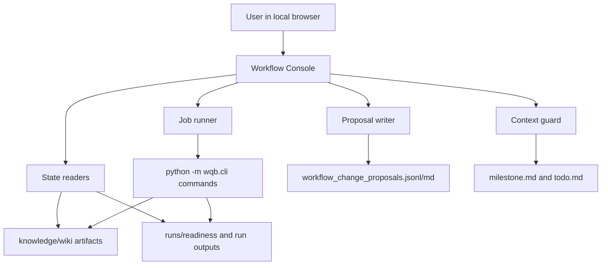

# Workflow Console Design

## Purpose

BrainWorkflow now has a usable CLI, readiness gates, scheduling artifacts,
subagent handoff packets, workflow-change proposal models, and a durable
Obsidian knowledge vault. The remaining operational gap is that the user must
remember command shapes and inspect scattered Markdown and JSONL files to decide
what to do next.

This design adds a local browser Workflow Console that becomes the human control
surface for the existing workflow. It does not replace the current CLI or alpha
research logic. It wraps those modules with a small local UI, structured
decision records, job status tracking, and context-preserving guardrails.

## Current Gaps

1. Research options are generated as Markdown and JSONL, but there is no
   decision screen for approving one option and turning it into a schedule.
2. Readiness, freshness, current schedules, and recent run directories are
   visible only by opening files or running commands.
3. Long-running jobs do not have a single job list that shows status, command,
   start time, end time, output paths, and failure reason.
4. Workflow-change proposals have a persistence model, but there is no user
   input form for recording a new proposal or reviewing proposed decisions.
5. Knowledge maintenance and research startup share no common control surface.
6. `milestone.md` protects context, but the workflow does not enforce milestone
   updates at the start and end of UI-triggered work.

## Goals

1. Provide a local browser UI for operating the existing BrainWorkflow modules.
2. Show current readiness, knowledge freshness, research options, schedules,
   and recent run status in one place.
3. Let the user choose a research objective and generate a concrete schedule
   without manually typing CLI arguments.
4. Let the user start safe workflow actions, with live API and submit actions
   gated by explicit controls.
5. Provide a structured workflow-proposal inbox where the user can submit,
   review, accept, reject, revise, or defer workflow changes.
6. Persist UI actions into files so Codex sessions can recover state without
   relying on chat memory.
7. Keep the first implementation small enough to maintain inside the existing
   Python project.

## Non-Goals

- Do not implement a cloud service or remote multi-user system.
- Do not store credentials in files.
- Do not auto-submit alphas.
- Do not bypass existing readiness gates.
- Do not rewrite the Scout, Seed, Discovery, Repair, or Submit workflow.
- Do not run broad Learn/forum recapture as a hidden side effect of opening the
  UI.
- Do not require a heavy JavaScript application for the first version.

## Architecture

After the Orchestrator slice, the console should call `workflow-*` commands or Orchestrator functions for official research flow. Low-level CLI commands remain visible as diagnostic actions, not the normal control path.

The console has two layers:

- `wqb.console_state`: read-only state aggregation from knowledge, runs,
  readiness reports, option cards, schedules, and proposals.
- `wqb.console_jobs`: controlled command execution and job history for approved
  actions.

The UI should call Python functions where practical and use CLI subprocesses
only for commands whose current behavior is already exposed through the CLI.
Every job writes a job record before running and updates it after completion or
failure.

## Component 1: Dashboard

The dashboard answers: "What is the current operating state?"

It should show:

- latest readiness report and blockers;
- freshness manifest summary and stale artifacts;
- current research option cards;
- current research schedule;
- recent run directories and job records;
- current milestone loop and next command;
- proposal inbox counts by status.

The dashboard is read-only except for buttons that navigate to specific action
screens.

## Component 2: Research Control

Research Control turns user decisions into existing workflow actions.

Supported first-version actions:

1. Generate or refresh research option cards.
2. Select one option card.
3. Generate a research schedule from the selected option.
4. Run readiness check for `plan-only`, `research`, or `submit-candidate`.
5. Launch a workflow manifest and handoff packets.

Live API behavior:

- `plan-only` is always available.
- `research` requires an explicit `enable_live_api` checkbox.
- `submit-candidate` requires both `enable_live_api` and a separate
  `confirm_submit` control.
- The UI must display the exact command or function action before starting the
  job.

## Component 3: Progress Board

The Progress Board aggregates status instead of forcing the user to inspect run
folders manually.

It reads:

- job history records;
- `run_manifest.json`;
- readiness reports;
- `simulation_events.jsonl`;
- `all_alphas.jsonl`;
- `run_errors.jsonl`;
- `candidates.csv`;
- handoff packet outputs where present.

Status categories:

- `not_started`;
- `running`;
- `blocked`;
- `failed`;
- `completed`;
- `needs_recovery`;
- `candidate_ready`.

The board should expose evidence paths for each status. It should not infer
submit readiness without the same hard-check rules used by the benchmark and
checker modules.

## Component 4: Knowledge Control

Knowledge Control handles maintenance workflows separately from research.

Supported first-version actions are split into two maintenance modes:

1. Research-record compile after research sessions.
2. Platform-material maintenance after Learn/docs/operators/activities/forum raw source refreshes and before starting new research.

Supported first-version actions:

1. Run `bootstrap-knowledge`.
2. Run `knowledge-health-check`.
3. Run `readiness-check` in maintenance or plan-only mode.
4. Run `compile-research-records`.
5. Show raw source index and compiled wiki artifact status.

The UI must clearly label these as maintenance actions. Research startup should
consume compiled artifacts; it should not trigger full raw-source recapture by
default.

If platform raw materials have been refreshed, the user must run knowledge
maintenance before starting research. The console should refuse research start
when compiled knowledge is stale or missing.

## Component 5: Workflow Proposal Inbox

The proposal inbox is the structured input surface for user workflow changes.
It prevents workflow design changes from living only in chat context.

The user can enter:

- issue type: `prod_correlation`, `self_correlation`,
  `pnl_signal_misclassified`, `data_schedule`, `template_innovation`,
  `maintenance`, or `manual_review`;
- summary;
- trigger;
- evidence paths;
- affected modules;
- proposed rule change;
- expected benefit;
- risk;
- required code changes;
- required knowledge updates.

The console writes proposals to:

- `knowledge/wiki/70_decisions/workflow_change_proposals.jsonl`
- `knowledge/wiki/70_decisions/workflow_change_proposals.md`

Decision states:

- `proposed`;
- `accepted`;
- `rejected`;
- `revise`;
- `deferred`;
- `applied`.

The first version records decisions only. Applying a proposal to code or wiki
rules remains a separate planned implementation task with tests.

## Component 6: Context Guard

Context Guard reduces lost state after usage limits, shutdowns, or context
compaction.

For every UI-triggered job, it writes:

- job id;
- command or action;
- start time;
- selected option or proposal id if relevant;
- expected output paths;
- current blocker if any;
- next command.

It updates:

- `milestone.md` with active loop, latest evidence, blocker, and next command;
- `todo.md` with a concise task note for project-level actions;
- `runs/console_jobs/<job_id>/job.json`;
- `runs/console_jobs/<job_id>/stdout.txt`;
- `runs/console_jobs/<job_id>/stderr.txt`;
- `runs/console_jobs/<job_id>/summary.md`.

If a job fails, the summary must include the exit code, evidence path, and
recommended recovery command.

## Data Contracts

### Console State Summary

The state reader should return a JSON-safe dict with:

- `readiness`;
- `freshness`;
- `option_cards`;
- `schedule`;
- `recent_runs`;
- `jobs`;
- `proposals`;
- `milestone`.

### Job Record

Each job record should include:

- `job_id`;
- `created_at`;
- `updated_at`;
- `status`;
- `action`;
- `command`;
- `cwd`;
- `inputs`;
- `outputs`;
- `exit_code`;
- `summary_path`;
- `stdout_path`;
- `stderr_path`.

### Proposal Record

Use the existing `WorkflowChangeProposal` model, extended only if tests show the
UI needs additional fields. Preserve existing proposal upsert behavior and user
decisions.

## Error Handling

- Missing knowledge artifacts should show a blocking readiness message and a
  button for `bootstrap-knowledge`.
- Stale artifacts should show a warning in plan-only mode and a blocker in
  strict research mode when the readiness gate classifies them that way.
- Running jobs should be single-action records; if two jobs are launched at the
  same time, each gets a separate job directory.
- A failed subprocess must never be reported as successful.
- The UI must never expose credential values in job logs or pages.
- Submit-related actions must require explicit confirmation in the same screen
  where the command is started.

## Testing Strategy

Use `unittest`, matching the existing project.

Focused tests should cover:

- state aggregation from fixture knowledge and run directories;
- parsing option cards, schedules, readiness reports, freshness reports, and
  proposal files;
- job record creation and status updates for success and failure;
- command construction for plan-only, research, and submit-candidate actions;
- refusal to run research without explicit live API enablement;
- refusal to run submit-candidate without explicit submit confirmation;
- proposal creation, decision update, and Markdown regeneration;
- context guard writes milestone and job summary fields.

UI smoke tests should verify that:

- the local server starts;
- the dashboard route renders current state;
- action routes create job records instead of silently doing nothing;
- proposal form submissions persist reviewable JSONL and Markdown.

## Implementation Slices

1. Add state aggregation module and tests.
2. Add job model, job runner, and tests.
3. Add proposal input/update functions and tests.
4. Add local Web server routes and minimal HTML views.
5. Wire action buttons to existing CLI commands through the job runner.
6. Add context guard updates for UI-triggered jobs.
7. Add README instructions and a `run_console` command or script.

## Acceptance Criteria

- The user can open a local browser page and see readiness, freshness, option
  cards, current schedule, recent jobs, and proposal status.
- The user can generate option cards and schedules without manually typing CLI
  arguments.
- The user can run plan-only readiness and launcher actions from the UI.
- The user can record a workflow modification proposal and later mark it as
  accepted, rejected, revised, deferred, or applied.
- Every UI-triggered action writes durable job and context artifacts.
- Existing CLI tests continue to pass.
- No live API or submit action can run without explicit UI confirmation.
